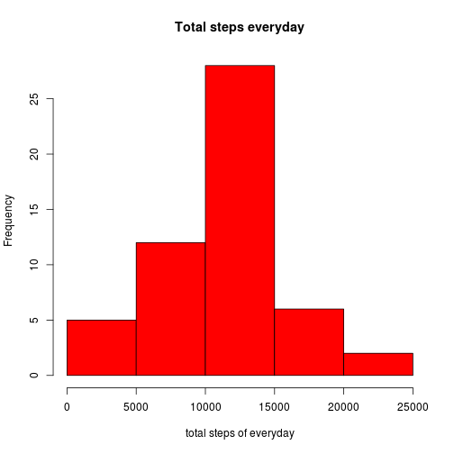
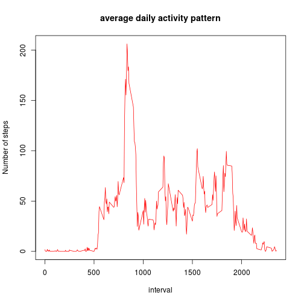
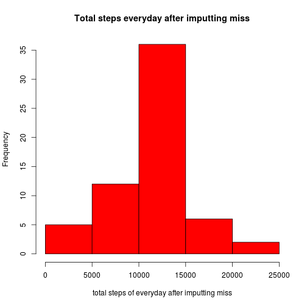
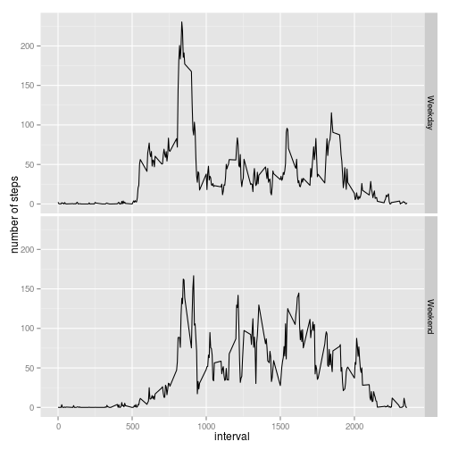

#This is the R markdown file to process a data set.

## First, we load and preprocess the data.


```r
dataset<-read.csv("activity.csv", colClasses="character", sep=",",header=TRUE)
dataset<-transform(dataset,date=as.Date(date))
dim(dataset)
```

```
## [1] 17568     3
```

```r
names(dataset)
```

```
## [1] "steps"    "date"     "interval"
```

```r
head(dataset)
```

```
##   steps       date interval
## 1  <NA> 2012-10-01        0
## 2  <NA> 2012-10-01        5
## 3  <NA> 2012-10-01       10
## 4  <NA> 2012-10-01       15
## 5  <NA> 2012-10-01       20
## 6  <NA> 2012-10-01       25
```
## Next, we solve what is mean total number of steps taken per day?

we calculate the total number of steps taken per day


```r
  library("dplyr")
```

```
## 
## Attaching package: 'dplyr'
## 
## The following objects are masked from 'package:stats':
## 
##     filter, lag
## 
## The following objects are masked from 'package:base':
## 
##     intersect, setdiff, setequal, union
```

```r
  library("plyr")
```

```
## -------------------------------------------------------------------------
## You have loaded plyr after dplyr - this is likely to cause problems.
## If you need functions from both plyr and dplyr, please load plyr first, then dplyr:
## library(plyr); library(dplyr)
## -------------------------------------------------------------------------
## 
## Attaching package: 'plyr'
## 
## The following objects are masked from 'package:dplyr':
## 
##     arrange, count, desc, failwith, id, mutate, rename, summarise,
##     summarize
```

```r
  daystep<-ddply(dataset, .(date),summarize,step_sum=sum(as.numeric(steps)))
  head(daystep)
```

```
##         date step_sum
## 1 2012-10-01       NA
## 2 2012-10-02      126
## 3 2012-10-03    11352
## 4 2012-10-04    12116
## 5 2012-10-05    13294
## 6 2012-10-06    15420
```

This is the barplot of the histgram of the total number of steps each day.


```r
with(daystep,hist(as.numeric(step_sum),col="red",xlab="total steps of everyday", main="Total steps everyday"))
```

 

Then, Calculate and report the mean and median of the total number of steps taken per day

```r
daystep_mean<-mean(daystep[[2]],na.rm=TRUE)
daystep_median<-median(daystep[[2]],na.rm=TRUE)  
```

So the mean is 1.0766189 &times; 10<sup>4</sup> and the median is 1.0765 &times; 10<sup>4</sup>.

## Then, let us solve what is the average daily activity pattern?

We make a time series plot (i.e. type = "l") of the 5-minute interval (x-axis) and the average number of steps taken, averaged across all days (y-axis)


```r
dataset_ave<-transform(dataset,interval=as.numeric(interval))
ave_pat<-ddply(dataset_ave, .(interval),summarize,step_ave=mean(as.numeric(steps), na.rm=TRUE))
head(ave_pat)
```

```
##   interval  step_ave
## 1        0 1.7169811
## 2        5 0.3396226
## 3       10 0.1320755
## 4       15 0.1509434
## 5       20 0.0754717
## 6       25 2.0943396
```

```r
dim(ave_pat)
```

```
## [1] 288   2
```

```r
with(ave_pat, plot(interval, step_ave, col="red",type="l", xlab="interval", main="average daily activity pattern", ylab="Number of steps"))
```

 
Then, we calculate the 5-minute interval, on average across all the days in the dataset, contains the maximum number of steps

```r
maxi_inter<-arrange(ave_pat,desc(step_ave))[1,1]
```
The interval which has the maximum steps is 835.

## Next, we want to imput the missing value.

First, we calculate and report the total number of missing values in the dataset (i.e. the total number of rows with NAs)


```r
miss_num<-sum(!complete.cases(dataset))
```
So the total number of missing values in the dataset is 2304.

Then, we devise a strategy for filling in all of the missing values in the dataset with the mean for that 5-minute interval, etc.

Make a new dataset

```r
dataset_miss<-transform(dataset,steps=as.numeric(steps),interval=as.numeric(interval))
```

Make a temporary vector to store the value which convert the interval value to the index number in the ave_pat dataset. It is convenient for the next step.

```r
temp<-as.integer(dataset_miss$interval/100,0)*12+((dataset_miss$interval)%%100)/5+1
```
Replace the NA value with the mean value of the corresponding 5-minute interval.

```r
dataset_miss$steps[is.na(dataset_miss$steps)]<-ave_pat[temp[is.na(dataset_miss$steps)],2]
head(dataset_miss)
```

```
##       steps       date interval
## 1 1.7169811 2012-10-01        0
## 2 0.3396226 2012-10-01        5
## 3 0.1320755 2012-10-01       10
## 4 0.1509434 2012-10-01       15
## 5 0.0754717 2012-10-01       20
## 6 2.0943396 2012-10-01       25
```

```r
miss_num<-sum(!complete.cases(dataset_miss))
```
Now the missing value number is 0. And the new data set is created.

Then make a histogram of the total number of steps taken each day and Calculate and report the mean and median total number of steps taken per day


```r
  daystep_miss<-ddply(dataset_miss, .(date),summarize,step_sum=sum(as.numeric(steps), na.rm=TRUE))
  head(daystep_miss)
```

```
##         date step_sum
## 1 2012-10-01 10766.19
## 2 2012-10-02   126.00
## 3 2012-10-03 11352.00
## 4 2012-10-04 12116.00
## 5 2012-10-05 13294.00
## 6 2012-10-06 15420.00
```

```r
with(daystep_miss,hist(as.numeric(step_sum),col="red",xlab="total steps of everyday after imputting miss", main="Total steps everyday after imputting miss"))
```

 

```r
daystep_mean_miss<-mean(daystep_miss[[2]],na.rm=TRUE)
daystep_median_miss<-median(daystep_miss[[2]],na.rm=TRUE) 
```
Lets compare this with the first part, we can see that they are different obviously. After replacing the missing value with some reasonable values, of course the total number of each day becomes larger, the histgram becomes higher and as a whole the estimate becomes higher. The mean value is 1.0766189 &times; 10<sup>4</sup> and the median value is 1.0766189 &times; 10<sup>4</sup>.
It is likely to be a more accurate estimte.

##Next, we solve the are there differences in activity patterns between weekdays and weekends.

We create a new factor variable in the dataset with two levels – “weekday” and “weekend” indicating whether a given date is a weekday or weekend day.


```r
new_dataset<-data.frame(dataset_miss, wek=ifelse((as.POSIXlt(dataset_miss$date)$wday) %in% c(1,2,3,4,5), "Weekday", "Weekend"))
head(new_dataset)
```

```
##       steps       date interval     wek
## 1 1.7169811 2012-10-01        0 Weekday
## 2 0.3396226 2012-10-01        5 Weekday
## 3 0.1320755 2012-10-01       10 Weekday
## 4 0.1509434 2012-10-01       15 Weekday
## 5 0.0754717 2012-10-01       20 Weekday
## 6 2.0943396 2012-10-01       25 Weekday
```

```r
new_dataset$wek<-factor(new_dataset$wek)
levels(new_dataset$wek)
```

```
## [1] "Weekday" "Weekend"
```

```r
new_ave_pat<-ddply(new_dataset, .(interval,wek),summarize,step_ave=mean(as.numeric(steps), na.rm=TRUE))

head(new_ave_pat)
```

```
##   interval     wek   step_ave
## 1        0 Weekday 2.25115304
## 2        0 Weekend 0.21462264
## 3        5 Weekday 0.44528302
## 4        5 Weekend 0.04245283
## 5       10 Weekday 0.17316562
## 6       10 Weekend 0.01650943
```
This easy. A factor variable is added.

Finally, we make a panel plot containing a time series plot (i.e. type = "l") of the 5-minute interval (x-axis) and the average number of steps taken, averaged across all weekday days or weekend days (y-axis). See the README file in the GitHub repository to see an example of what this plot should look like using simulated data.


```r
library("ggplot2")
qplot(interval,step_ave, data=new_ave_pat,facets=wek~.,geom="line")+ylab("number of steps")
```

 

